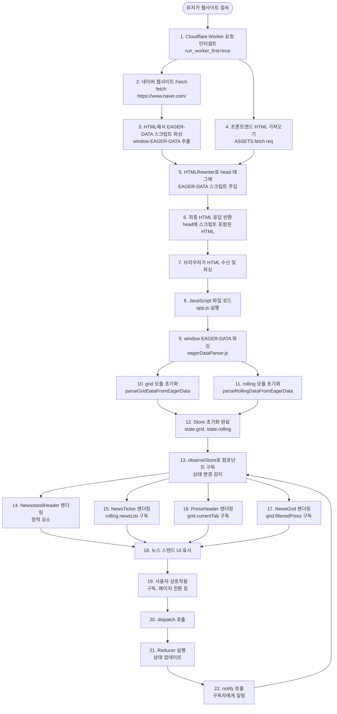
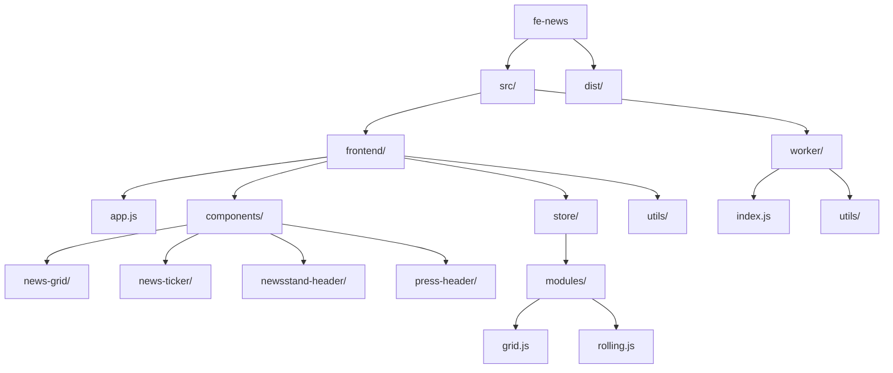
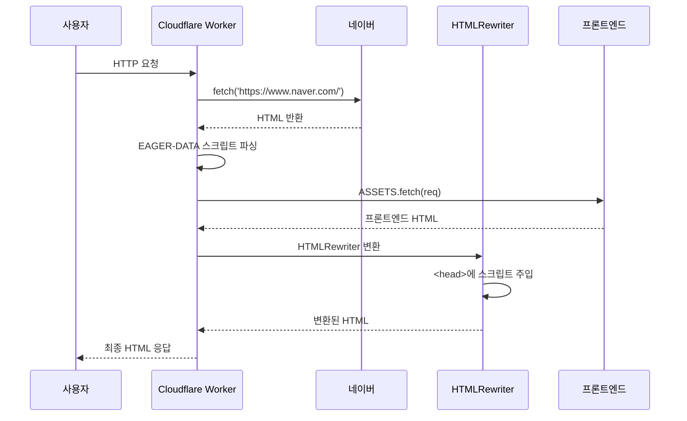
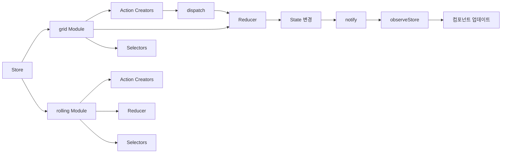
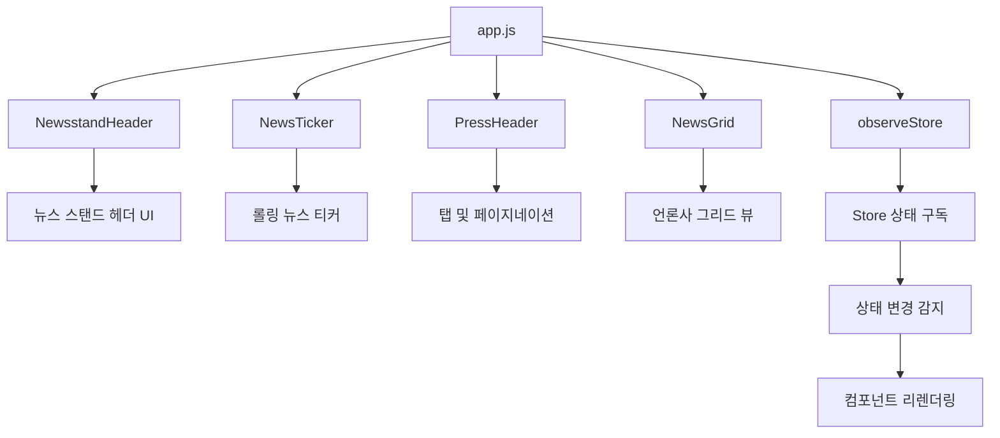
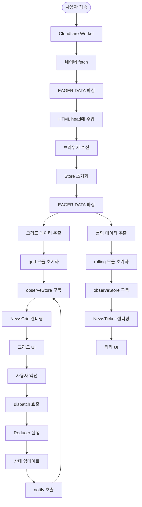
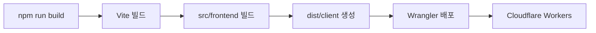

## 프로젝트 링크
**배포 URL**: https://fe-news.forhyundaisofteer.workers.dev/

## 기술 스택
- **빌드 도구**: Vite 6.4.1
- **런타임**: Cloudflare Workers
- **언어**: JavaScript (ES Modules)
- **상태 관리**: 커스텀 Store (Redux 패턴)

## 프로젝트 구조
### 전체 아키텍처

#### 사용자 플로우



#### 단계별 상세 설명

1. **유저가 웹사이트 접속**: 유저가 브라우저에서 https://fe-news.forhyundaisofteer.workers.dev 에 접속합니다. AWS (Route53 + CloudFront) 방식은 DNS가 사용자 위치를 파악해 서로 다른 IP 주소(GeoDNS)를 알려주는 반면, Cloudflare는 전 세계가 동일한 Anycast IP를 사용하며 인터넷 망의 BGP 라우팅을 통해 물리적으로 가장 가까운 엣지로 자동 연결됩니다.
2. **요청 가로채기 및 실행**: 요청이 엣지 서버에 도착하면, **Worker**가 이 요청을 가로챕니다. 컨테이너를 새로 만드는 AWS Lambda와 달리 단순히 Cloudflare Workers는 V8 엔진을 켜놓고 요청이 들어오면 isolate만 시키고 바로 실행하는 식으로 동작해 콜드 스타트 문제에서 자유롭습니다. 
2. **Worker 인터셉트**: `wrangler.toml`의 `run_worker_first = true` 설정으로 모든 요청이 Worker를 먼저 거침
3. **네이버 데이터 Fetch**: Worker에서 네이버 메인 페이지를 fetch하여 최신 뉴스 데이터 획득
4. **EAGER-DATA 파싱**: 네이버 HTML에서 `window["EAGER-DATA"]` 스크립트 블록 추출
5. **프론트엔드 HTML 로드**: 빌드된 프론트엔드 HTML을 ASSETS에서 가져옴
6. **스크립트 주입**: `HTMLRewriter`를 사용하여 파싱한 EAGER-DATA 스크립트를 `<head>` 태그에 주입
7. **HTML 응답**: 주입된 스크립트가 포함된 최종 HTML을 브라우저에 반환
9. **브라우저 파싱**: 브라우저가 HTML을 파싱하고 JavaScript 파일들을 로드
10. **app.js 실행**: 메인 애플리케이션 코드 실행 시작
11. **EAGER-DATA 접근**: `window["EAGER-DATA"]` 객체에 접근하여 데이터 파싱
12. **Store 초기화**: 
    - `grid` 모듈: `parseGridDataFromEagerData()`로 언론사 리스트 추출
    - `rolling` 모듈: `parseRollingDataFromEagerData()`로 롤링 뉴스 리스트 추출
13. **컴포넌트 구독**: `observeStore`를 통해 각 컴포넌트가 필요한 상태를 구독
14. **초기 렌더링**: 
    - NewsstandHeader: 정적 요소로 즉시 렌더링
    - NewsTicker: `rolling.newsList` 구독하여 롤링 뉴스 표시
    - PressHeader: `grid.currentTab` 구독하여 탭 및 페이지네이션 표시
    - NewsGrid: `grid.filteredPress` 구독하여 언론사 그리드 표시
15. **UI 표시**: 모든 컴포넌트가 렌더링되어 사용자에게 뉴스 스탠드 UI 표시
16. **사용자 상호작용**: 구독/구독 해제, 탭 전환, 페이지 이동 등의 액션 발생
17. **상태 업데이트**: `dispatch` → `reducer` → `notify` → 구독한 컴포넌트 자동 리렌더링

### 디렉토리 구조



## 주요 기능

### 1. Worker 레이어 (서버 사이드)

#### 역할
- 네이버 웹사이트에서 HTML을 가져옴
- `window["EAGER-DATA"]` 스크립트를 파싱
- 프론트엔드 HTML의 `<head>`에 해당 스크립트를 주입

#### 파일 구조
```
src/worker/
├── index.js              # Worker 진입점
└── utils/
    ├── naverParser.js    # 네이버 데이터 파싱
    └── headHandler.js    # HTMLRewriter 핸들러
```

#### 데이터 흐름



### 2. 프론트엔드 레이어 (클라이언트 사이드)

#### 상태 관리 (Store)

프로젝트는 Redux 패턴을 따르는 커스텀 Store를 구현했습니다.



#### Store 모듈

##### 1. Grid Module (`store/modules/grid.js`)
- **기능**: 뉴스 스탠드 그리드 뷰 관리
- **상태**:
  - `allPress`: 모든 언론사 리스트
  - `subscribedIds`: 구독한 언론사 ID 배열
  - `currentTab`: 현재 탭 ('all' | 'subscribed')
  - `currentPage`: 현재 페이지 번호
- **액션**:
  - `SET_TAB`: 탭 변경
  - `SUBSCRIBE` / `UNSUBSCRIBE` / `TOGGLE_SUBSCRIBE`: 구독 관리
  - `SET_PAGE` / `NEXT_PAGE` / `PREV_PAGE`: 페이지네이션

##### 2. Rolling Module (`store/modules/rolling.js`)
- **기능**: 뉴스 티커(롤링 뉴스) 데이터 관리
- **상태**:
  - `newsList`: 뉴스 리스트
  - `isLoading`: 로딩 상태
- **액션**:
  - `SET_NEWS_LIST`: 뉴스 리스트 설정
  - `UPDATE_NEWS_LIST`: 뉴스 리스트 업데이트

#### 컴포넌트 구조



##### 주요 컴포넌트

1. **NewsstandHeader** (`components/newsstand-header/`)
   - 뉴스 스탠드 상단 헤더
   - 그리드/리스트 뷰 전환 버튼

2. **NewsTicker** (`components/news-ticker/`)
   - 하단 롤링 뉴스 티커
   - `rolling` 모듈의 `newsList`를 구독

3. **PressHeader** (`components/press-header/`)
   - 언론사 리스트 상단 헤더
   - 전체/구독 탭 전환
   - 페이지네이션 컨트롤

4. **NewsGrid** (`components/news-grid/`)
   - 언론사 그리드 뷰
   - `grid` 모듈의 `filteredPress`를 구독
   - 페이지네이션 지원

#### 유틸리티 함수

1. **eagerDataParser.js**
   - `parseGridDataFromEagerData()`: 그리드 데이터 파싱
   - `parseRollingDataFromEagerData()`: 롤링 뉴스 데이터 파싱

2. **pressRenderer.js**
   - 언론사 데이터를 DOM에 렌더링

3. **compare.js**
   - `shallowEqual`: 얕은 비교 함수 (성능 최적화)

4. **themeDetector.js**
   - 테마 감지 유틸리티

## 데이터 흐름

### 전체 데이터 흐름도



### EAGER-DATA 구조

Worker에서 네이버로부터 가져온 데이터는 다음과 같은 구조를 가집니다:

```javascript
window["EAGER-DATA"] = {
  "PC-MEDIA-WRAPPER": {
    blocks: [
      {
        blocks: [
          {
            blocks: [
              // PC-NEWSSTAND-PRESS-BLOCK 배열
              { "@type": "PC-NEWSSTAND-PRESS-BLOCK", pid, name, logoDark, logoLight },
              ...
            ]
          }
        ]
      }
    ]
  },
  "PC-NEWSSTAND-YONHAP": {
    materials: [
      // MATERIAL-PC-NEWS-ONELINE 배열
      { "@type": "MATERIAL-PC-NEWS-ONELINE", title, url, officeName, officeId, aid },
      ...
    ]
  }
}
```

## 빌드 및 배포

### 로컬 개발

```bash
npm start
# vite build && wrangler dev --port 3000
```

### 프로덕션 빌드

```bash
npm run build
# vite build
```

### 배포

```bash
npm run deploy
# npm run build && wrangler deploy
```

### 빌드 프로세스



## 주요 특징

### 1. 서버리스 아키텍처
- Cloudflare Workers를 활용한 엣지 컴퓨팅
- 서버 관리 불필요
- 글로벌 CDN을 통한 빠른 응답

### 2. 상태 관리 패턴
- Redux 패턴을 따르는 커스텀 Store
- 모듈별로 분리된 Reducer
- Selector를 통한 효율적인 상태 선택
- `observeStore`를 통한 구독 기반 리렌더링

### 3. 컴포넌트 기반 구조
- 기능별로 분리된 컴포넌트
- 각 컴포넌트는 독립적인 렌더링 함수 제공
- CSS 모듈 방식으로 스타일 관리

### 4. 데이터 파싱 전략
- Worker에서 네이버 데이터를 미리 가져와 주입
- 클라이언트에서는 `window["EAGER-DATA"]`에 접근하여 파싱
- 타입 검증을 통한 안전한 데이터 추출

### 5. 성능 최적화
- `shallowEqual`을 통한 불필요한 리렌더링 방지
- Selector 패턴으로 필요한 상태만 구독
- 페이지네이션으로 대량 데이터 처리

## 향후 개발 계획

- [ ] 롤링 기능 구현
- [ ] 리스트뷰 구현
- [ ] 다크모드 지원
- [ ] 접근성(A11y) 개선
- [ ] 성능 모니터링 추가

## 개발 히스토리

자세한 개발 히스토리는 [README.md](./README.md)를 참고하세요.

---

**작성일**: 2025-01-07  
**작성자**: Jiun Hong


### 백엔드 플로우


1. **유저가 웹사이트 접속**: 유저가 브라우저에서 https://fe-news.forhyundaisofteer.workers.dev 에 접속합니다. AWS (Route53 + CloudFront) 조합이 DNS가 사용자 위치를 파악해 서로 다른 IP 주소(GeoDNS)를 알려주는 방식으로 동작하는 것과 다르게, Cloudflare는 전 세계가 동일한 Anycast IP를 사용하며 인터넷 망의 BGP 라우팅을 통해 물리적으로 가장 가까운 엣지로 연결됩니다.
2. **요청 가로채기 및 실행**: 요청이 엣지 서버에 도착하면, Cloudflare Workers가 이 요청을 가로챕니다. 컨테이너를 새로 만드는 AWS Lambda와 달리, Cloudflare Workers는 V8 엔진을 켜놓고 요청이 들어오면 isolate만 시키고 바로 실행하는 식으로 동작해 콜드 스타트 문제에서 자유롭습니다. 
3. **네이버 데이터 fetch** 및 파싱: 실행된 Worker는 `fetch()`를 이용하여 https://naver.com 로 데이터를 요청합니다. 서버에서 요청을 하므로 CORS 문제에서 자유롭습니다. 파싱을 하여 네이버의 `<head>`에 들어간 `window["EAGER-DATA"]` 주입 로직을 가져옵니다.
4. **HTML Rewrite**: Worker는 `env.ASSETS.fetch()`를 호출하여 `index.html`를 포함한 Static Assets 를 가져옵니다. `env.ASSETS`가 AWS S3라고 생각하시면 됩니다. Worker이 제공해주는 `HTMLRewriter`를 이용하여, 아까 파싱한 `window["EAGER-DATA"]` 데이터를 `index.html`에 스트림 방식으로 주입합니다.
5. **HTML Response**: 조립이 완료된 최종 HTML이 사용자의 브라우저로 전송됩니다. 