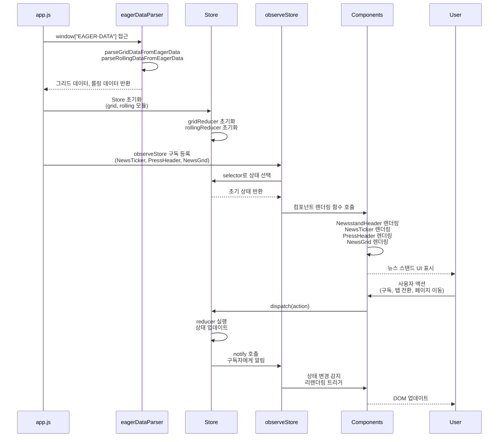

# 프론트엔드 플로우

## 개요

프론트엔드 플로우는 `app.js` 실행부터 사용자 인터랙션까지의 전체 과정을 설명합니다. Worker에서 주입한 `window["EAGER-DATA"]`를 파싱하여 Store를 초기화하고, 컴포넌트를 렌더링하며, 사용자 액션을 처리합니다.

## 프론트엔드 플로우



## 단계별 상세 설명

1. **app.js 실행**: 메인 진입점인 `app.js`가 실행됩니다. 이 파일은 모든 컴포넌트와 Store를 초기화하는 역할을 합니다.

2. **EAGER-DATA 파싱**: `eagerDataParser.js`를 통해 `window["EAGER-DATA"]` 객체에 접근하여 데이터를 파싱합니다:
   - `parseGridDataFromEagerData()`: 언론사 그리드 데이터 추출
   - `parseRollingDataFromEagerData()`: 롤링 뉴스 데이터 추출

3. **Store 초기화**: 파싱된 데이터를 기반으로 Store를 초기화합니다:
   - `grid` 모듈: 언론사 리스트, 구독 상태, 현재 탭/페이지 정보
   - `rolling` 모듈: 롤링 뉴스 리스트
   
   각 모듈의 reducer가 초기 상태를 생성할 때 `parseGridDataFromEagerData()`와 `parseRollingDataFromEagerData()`를 호출합니다.

4. **컴포넌트 구독 등록**: `observeStore`를 통해 각 컴포넌트가 필요한 상태를 구독합니다:
   - **NewsTicker**: `rolling.newsList` 구독
   - **PressHeader**: `grid.currentTab`, `grid.subscribedIds.length` 구독
   - **NewsGrid**: `grid.filteredPress` 구독
   
   `observeStore`는 React-Redux의 `useSelector`와 유사한 역할을 하며, `shallowEqual`을 사용하여 불필요한 리렌더링을 방지합니다.

5. **초기 렌더링**: 구독이 등록되면 즉시 초기 상태로 컴포넌트를 렌더링합니다:
   - **NewsstandHeader**: 정적 요소로 즉시 렌더링
   - **NewsTicker**: 롤링 뉴스 리스트 표시
   - **PressHeader**: 탭 및 페이지네이션 UI 표시
   - **NewsGrid**: 언론사 그리드 뷰 표시

6. **사용자 인터랙션 처리**: 사용자가 구독/구독 해제, 탭 전환, 페이지 이동 등의 액션을 수행하면:
   - 컴포넌트가 `dispatch(action)` 호출
   - Store의 `reducer`가 실행되어 상태 업데이트
   - Store가 `notify()`를 호출하여 모든 구독자에게 알림
   - `observeStore`가 상태 변경을 감지하고 `shallowEqual`로 비교
   - 상태가 변경되었으면 컴포넌트의 렌더링 함수를 다시 호출
   - DOM이 업데이트되어 사용자에게 변경사항이 반영됨

## 주요 특징

### 1. 구독 기반 리렌더링
- 컴포넌트는 필요한 상태만 구독하여 효율적으로 업데이트됩니다
- `shallowEqual`을 통한 얕은 비교로 불필요한 리렌더링을 방지합니다

### 2. 모듈화된 상태 관리
- `grid`와 `rolling` 모듈로 상태가 분리되어 관리됩니다
- 각 모듈은 독립적인 reducer, action creators, selectors를 가집니다

### 3. 선언적 렌더링
- 컴포넌트는 상태를 구독하고, 상태 변경 시 자동으로 리렌더링됩니다
- 명령형 DOM 조작 대신 선언적 방식으로 UI를 관리합니다

## 관련 파일

- `src/frontend/app.js`: 메인 진입점
- `src/frontend/store/index.js`: Store 초기화
- `src/frontend/store/observeStore.js`: 구독 메커니즘
- `src/frontend/store/modules/grid.js`: 그리드 상태 관리
- `src/frontend/store/modules/rolling.js`: 롤링 뉴스 상태 관리
- `src/frontend/utils/eagerDataParser.js`: EAGER-DATA 파싱 유틸리티

## 상태 관리

이 프로젝트는 **Redux 아키텍처**와 **Ducks 패턴**을 결합하여 상태 관리를 구현했습니다.

### Redux 아키텍처

참조: [Redux Fundamentals - Concepts and Data Flow](https://redux.js.org/tutorials/fundamentals/part-2-concepts-data-flow)

Redux의 핵심 원칙을 따릅니다:

1. **단일 진실 공급원 (Single Source of Truth)**: 하나의 Store에 모든 상태를 저장
2. **읽기 전용 상태 (State is Read-Only)**: 상태는 직접 수정하지 않고, action을 통해서만 변경
3. **순수 함수로 변경 (Changes are Made with Pure Functions)**: Reducer는 순수 함수로 새로운 상태를 반환

#### Redux vs Flux

| 항목 | Flux | Redux |
|------|------|-------|
| **Dispatcher** | 중앙 Dispatcher가 모든 액션을 라우팅 | Dispatcher 없음 (Store가 직접 dispatch 처리) |
| **Store** | 여러 Store 존재 가능 | 단일 Store (Single Source of Truth) |
| **상태 변경** | Store가 직접 자신의 상태를 변경 | Reducer가 순수 함수로 새 state 반환 |
| **데이터 흐름** | Action → Dispatcher → Store → View | Action → Store → Reducer → newState → View |
| **보일러플레이트** | 많음 (Dispatcher, 각 Store별 로직) | 적음 (단일 Store + Reducer) |
| **복잡도** | 중간 (여러 Store 관리) | 낮음 (단일 Store로 단순화) |
| **예측 가능성** | 보통 | 높음 (순수 함수로 인한 예측 가능한 상태 변경) |
| **디버깅** | 어려움 (여러 Store 추적) | 쉬움 (Redux DevTools 사용 가능) |

**이 프로젝트는 Redux 패턴을 채택한 이유:**
- 단일 Store로 상태 관리가 단순하고 예측 가능함
- Reducer가 순수 함수이므로 테스트와 디버깅이 용이함
- Flux의 단방향 데이터 흐름은 유지하면서도 구조를 단순화함

```javascript
// Store 클래스 구조
export class Store {
  constructor(initialState, reducer) {
    this.state = { ...initialState };
    this.reducer = reducer;
    this.subscribers = [];
  }

  dispatch(actionType, payload) {
    const newState = this.reducer(this.state, actionType, payload);
    this.state = newState;
    this.notify(); // 구독자에게 상태 변경 알림
  }

  subscribe(callback) {
    this.subscribers.push(callback);
    return () => { /* unsubscribe */ };
  }
}
```

### Ducks 패턴

각 모듈 파일(`grid.js`, `rolling.js`)에 관련된 모든 로직을 함께 배치합니다:

1. **Action Types**: 액션 타입 상수 정의 (PREFIX 기반 네이밍)
2. **Action Creators**: 액션 생성 함수 (named export)
3. **Reducer**: 상태 변경 로직 (default export)
4. **Selectors**: 상태 선택 로직 (named export)

```javascript
// grid.js - Ducks 패턴 예시
const PREFIX = 'grid';

// 1. Action Types
const TOGGLE_SUBSCRIBE = `${PREFIX}/TOGGLE_SUBSCRIBE`;

// 2. Action Creators (named export)
export const toggleSubscribe = (pressName) => ({ 
  type: TOGGLE_SUBSCRIBE, 
  payload: pressName 
});

// 3. Reducer (default export)
export default function gridReducer(state = initialState, action) {
  switch (action.type) {
    case TOGGLE_SUBSCRIBE:
      // 상태 변경 로직
      return { ...state, subscribedIds: updatedSubscribed };
    default:
      return state;
  }
}

// 4. Selectors (named export)
export const selectors = {
  getFilteredPress: (state) => { /* ... */ }
};
```

### Root Reducer 패턴

여러 모듈의 reducer를 하나로 결합합니다:

```javascript
// store/index.js
function rootReducer(state, actionType, payload) {
  const action = typeof actionType === 'string' 
    ? { type: actionType, payload }
    : actionType;

  return {
    grid: gridReducer(state?.grid, action),
    rolling: rollingReducer(state?.rolling, action),
  };
}
```

### 데이터 흐름

```
View → dispatch(action) → Store → rootReducer → moduleReducer → newState → notify → View 업데이트
```

## 구독 기능 핵심 로직

구독 기능은 `grid` 모듈에서 관리되며, 사용자가 언론사를 구독/구독 해제할 수 있는 기능을 제공합니다.

### 상태 구조

```javascript
{
  allPress: [...],           // 모든 언론사 리스트
  subscribedIds: [...],      // 구독한 언론사 이름 배열
  currentTab: 'all',         // 현재 탭 ('all' | 'subscribed')
  currentPage: 0             // 현재 페이지 번호
}
```

### Action Types & Creators

```javascript
// Action Types
const SUBSCRIBE = 'grid/SUBSCRIBE';
const UNSUBSCRIBE = 'grid/UNSUBSCRIBE';
const TOGGLE_SUBSCRIBE = 'grid/TOGGLE_SUBSCRIBE';

// Action Creators
export const subscribe = (pressName) => ({ 
  type: SUBSCRIBE, 
  payload: pressName 
});

export const unsubscribe = (pressName) => ({ 
  type: UNSUBSCRIBE, 
  payload: pressName 
});

export const toggleSubscribe = (pressName) => ({ 
  type: TOGGLE_SUBSCRIBE, 
  payload: pressName 
});
```

### Reducer 로직

```javascript
case TOGGLE_SUBSCRIBE: {
  const isSubscribed = state.subscribedIds.includes(payload);
  const updatedSubscribed = isSubscribed
    ? state.subscribedIds.filter((id) => id !== payload)  // 구독 해제
    : [...state.subscribedIds, payload];                   // 구독 추가
  
  // 'subscribed' 탭일 때는 구독 상태 변경 시 페이지를 0으로 리셋
  const resetPage = state.currentTab === 'subscribed' ? 0 : state.currentPage;
  
  return { 
    ...state, 
    subscribedIds: updatedSubscribed, 
    currentPage: resetPage 
  };
}
```

### Selector 로직

구독 상태에 따라 필터링된 언론사 리스트를 제공합니다:

```javascript
export const selectors = {
  getFilteredPress: (state) => {
    const { allPress, currentTab, subscribedIds } = state;
    if (currentTab === 'subscribed') {
      // 'subscribed' 탭: 구독한 언론사만 필터링
      return allPress.filter((press) => subscribedIds.includes(press.name));
    }
    // 'all' 탭: 모든 언론사 반환
    return allPress;
  }
};
```

### 컴포넌트에서의 사용

```javascript
// newsGrid.js
containerElement.addEventListener('click', (e) => {
  const btn = e.target.closest('.news-grid-subscribe-btn');
  if (btn) {
    const pressName = btn.getAttribute('data-press-name');
    store.dispatch(toggleSubscribe(pressName)); // 액션 디스패치
  }
});
```

### 주요 특징

1. **토글 방식**: `TOGGLE_SUBSCRIBE` 액션으로 구독/구독 해제를 한 번에 처리
2. **페이지 리셋**: 구독 상태 변경 시 'subscribed' 탭에서는 페이지를 0으로 리셋하여 UI 일관성 유지
3. **불변성 유지**: 배열을 직접 수정하지 않고 새 배열을 생성하여 상태 업데이트

## 롤링 기능 핵심 로직

롤링 기능은 `rolling` 모듈에서 관리되며, 뉴스 티커에 표시될 롤링 뉴스 리스트를 관리합니다.

### 상태 구조

```javascript
{
  newsList: [...],      // 롤링 뉴스 리스트
  isLoading: false      // 로딩 상태 (향후 확장용)
}
```

### Action Types & Creators

```javascript
// Action Types
const SET_NEWS_LIST = 'rolling/SET_NEWS_LIST';
const UPDATE_NEWS_LIST = 'rolling/UPDATE_NEWS_LIST';

// Action Creators
export const setNewsList = (newsList) => ({ 
  type: SET_NEWS_LIST, 
  payload: newsList 
});

export const updateNewsList = (newsList) => ({ 
  type: UPDATE_NEWS_LIST, 
  payload: newsList 
});
```

### Reducer 로직

```javascript
export default function rollingReducer(state = initialState, action) {
  const { type, payload } = action;

  switch (type) {
    case SET_NEWS_LIST:
      return { ...state, newsList: payload || [] };
    case UPDATE_NEWS_LIST:
      return { ...state, newsList: payload || [] };
    default:
      return state;
  }
}
```

### 초기 상태 생성

초기 상태는 `window["EAGER-DATA"]`에서 파싱한 데이터로 설정됩니다:

```javascript
const getInitialState = () => {
  try {
    const newsList = parseRollingDataFromEagerData();
    return {
      newsList,
      isLoading: false,
    };
  } catch (error) {
    console.error(`Error parsing window["EAGER-DATA"]:`, error);
    return {
      newsList: [],
      isLoading: false,
    };
  }
};
```

### Selector 로직

```javascript
export const selectors = {
  getNewsList: (state) => state.newsList || [],
  getNewsCount: (state) => (state.newsList || []).length,
  isLoading: (state) => state.isLoading || false,
};
```

### 컴포넌트에서의 사용

```javascript
// app.js
observeStore(
  (state) => rollingSelectors.getNewsList(state.rolling || {}),
  (newsList) => {
    renderNewsTicker('#news-ticker-container', newsList);
  },
  shallowEqual
);
```

### 뉴스 티커 렌더링

뉴스 리스트를 두 개의 롤링 박스로 나누어 무한 스크롤 효과를 구현합니다:

```javascript
// newsTicker.js
const midPoint = Math.ceil(allNewsItems.length / 2);
const leftList = allNewsItems.slice(0, midPoint);
const rightList = allNewsItems.slice(midPoint);

// 두 개의 rolling-box를 생성하여 연속적인 롤링 효과 구현
```

### 주요 특징

1. **단순한 상태 구조**: 뉴스 리스트와 로딩 상태만 관리
2. **에러 처리**: 파싱 실패 시 빈 배열로 초기화하여 안정성 확보
3. **확장 가능성**: `isLoading` 필드를 통해 향후 비동기 데이터 로딩 기능 추가 가능
4. **선언적 구독**: `observeStore`를 통해 상태 변경 시 자동으로 뉴스 티커가 업데이트됨
